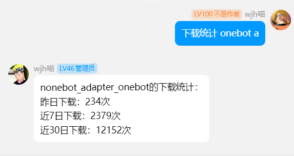
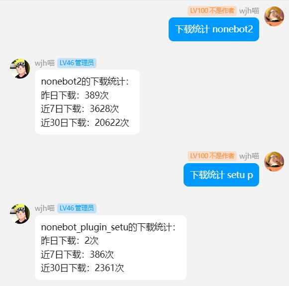

  
   
  

# nonebot-plugin-pypistats

_✨ 通过机器人查看PyPi包的下载次数 ✨_

一个通过nonebot与pypistats对接实现的下载量查询插件

> [!IMPORTANT]
> 数据是否可信请自行判断

## 💿 安装

使用 nb-cli 安装

在 nonebot2 项目的根目录下打开命令行, 输入以下指令即可安装

    nb plugin install nonebot-plugin-pypistats

使用包管理器安装

在 nonebot2 项目的插件目录下, 打开命令行, 根据你使用的包管理器, 输入相应的安装命令

pip

    pip install nonebot-plugin-pypistats

pdm

    pdm add nonebot-plugin-pypistats

poetry

    poetry add nonebot-plugin-pypistats

conda

    conda install nonebot-plugin-pypistats

打开 nonebot2 项目根目录下的 `pyproject.toml` 文件, 在 `[tool.nonebot]` 部分追加写入

    plugins = ["nonebot_plugin_pypistats"]

## 🎉 使用
### 指令表
| 指令 | 权限 | 需要@ | 范围 | 说明 |
|:-----:|:----:|:----:|:----:|:----:|
| 下载统计 [包名] [类型] | all | 否 | all | 类型选项有p：nonebot-plugin-和a: nonebot-adapter-两种，如果不写参数的话那就是直接查询|

### 指令例子

点击展开

